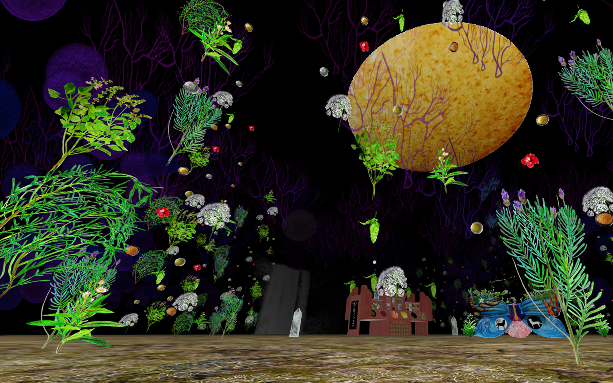

# Earth We Are and Shall Return

Welcome to the documentation of this project.  
Click the banner above to watch the video overview on YouTube.

## Project Images

Here are some of the images related to this project:

- [boticarioewa.jpg](boticarioewa.jpg)  
- [Videoinstalationewa.jpg](Videoinstalationewa.jpg)  
- [Biopolimerosewa.jpg](Biopolimerosewa.jpg)  
- [terrarium.jpg](terrarium.jpg)  
- [borboletaewa.png](borboletaewa.png)

## About the Project

Digital Media Artwork about the creative process of the artist’s edible biopolymers, presented as an archaeology of the future that collects the vestiges of efforts set on the current and historical moment, focused on the development of daily solutions in communion with various of the 2030 SDGs, drawing a possible sustainable landscape.

Having an apothecary as the main character of the installation, the laboratory is used as a metaphor for a space of knowledge and creation, provoking reflection about the urgency of taking advantage of our current level of technological and scientific development to put it at the service of healing the planet.

*Paraty – São Paulo, Brazil, 2021–2022*

Winner of the Open Call *Visions of Transformations to Sustainability* by Fraunhofer Institute for Systems and Innovation Research ISI, in collaboration with the UNESCO City of Media Arts Office and the City of Karlsruhe’s Department of Cultural Affairs, presented at the International Conference of Sustainability 2021, Karlsruhe, Germany.
