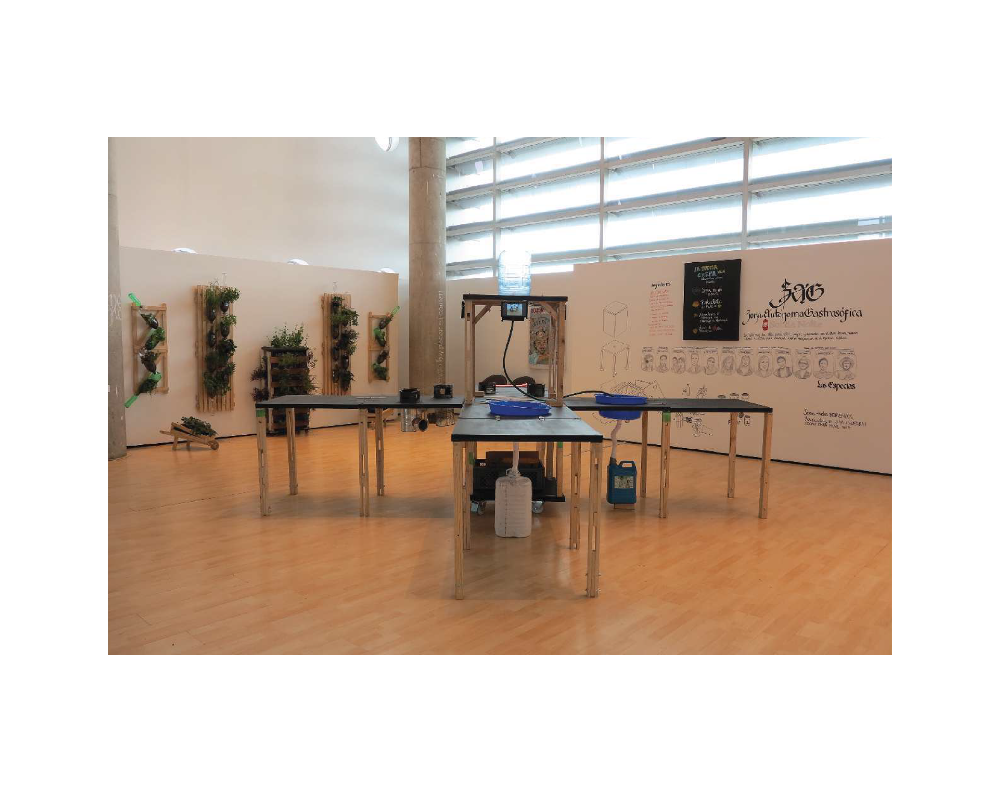

# ZAG — Autonomous Gastrosophical Zone
### *Pirate Mobile Kitchen*

**ZAG** is a nomadic, experimental, and autonomous public intervention project. It starts with a DIWO process to build the pirate mobile kitchen, a portable and creative laboratory with a basic pop up kitchen structure, designed to develop multidisciplinary artistic urban interventions by collective work and collaborative processes that experiment around culinary as the society's principal meeting point, an artistic language capable of provoking every human sense, a political node, and an analog network. 

It was created with a foldable and removable system to be constructed in a collective, collaborative, and multidisciplinary DIWO process. The project developed four volumes in four different cities around South America: La Paz, Bolivia; São Paulo, Brazil; Medellín, Colombia; and Bogotá, Colombia.

Click the banner above to watch the video overview.

---

## Concept

ZAG is conceived as an **autonomous gastrosophical zone**—a temporary kitchen-laboratory that appears unexpectedly in streets, parks, markets, art, and cultural events.  
It challenges the boundaries between:

- cooking and contemporary art 
- nourishment and storytelling  
- piracy and autonomy  
- public rituals and spontaneous gatherings  

ZAG occupies space like a small, friendly rebellion: a pop-up territory where eating becomes an artistic act.

---

## Methodology

- Portable kitchen modules adapted to each location  
- Improvised and site-responsive menus  
- Collaboration with local communities  
- Spontaneous workshops and micro-rituals  
- Use of local, seasonal, accessible ingredients  
- Emphasis on sensorial and symbolic experience  

---

## Past Activations

- Street interventions
- Art exhibitions 
- Cultural festivals  
- Artistic residencies  
- Collaborative urban kitchens  
- Community gatherings  

---

## Gallery

### Images
- `ZAG-2.jpg`  
- `ZAG1EQUIPO.jpg`  
- `ZAG1GOPRO.jpg`  
- `ZAG2.jpg`  
- `ZAG4.png`  
- `ZAGboceto.jpg`  

*(Click on images to view larger in GitHub)*

---

## Videos

- [ZAG 4 Laboratory](https://youtu.be/S2MsKf0ug6E)  
- [Pirate Mobile Kitchen in Action ZAG 3](https://youtu.be/d4UoWzP2Ur8)  
- [ZAG 2 Activation](https://youtu.be/QQDoWyuo7-g)  

> *Click the links to watch the videos.*

---

## Credits

Concept, design, and authorship by **Ingrid Cuestas**.  

